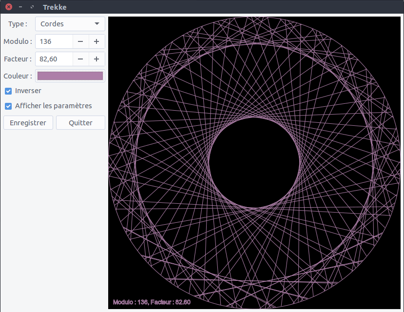

# Trekke

Trekke va vous permettre de réaliser des formes originales simplement à partir d'un modulo et d'un facteur. Voici le 
rendu que vous pouvez obtenir :


Petite démonstration du logiciel


Le programme est fournit avec deux versions, une version possédant une interface graphique et une fonctionnant
directement depuis le terminal.

Voici l'interface graphique de Trekke (le gif datant un peu) :



## Installation

Pour fonctionner, Trekke a besoin de [GTK+](http://www.gtk.org/) et de [Python3](https://www.python.org/). 
Pour enregistrer les images au format *.png* il vous sera également demandé d'installer [cairosvg](http://cairosvg.org/).

Pour commencer, installer les packets de base :  

```
sudo apt-get update
sudo apt-get install python3 python3-pip python3-gi gobject-introspection git
```

Si vous voulez enregistrer vos images : 

```
pip3 install --user cairosvg
```

Téléchargez le projet :

```
git clone git@github.com:boopr/Trekke.git
```

Pour lancer Trekke en mode graphique : 

```
cd Trekke
python3 main.py
```

Ou dans le terminal :

```
cd Trekke
python3 drawer.py
```
